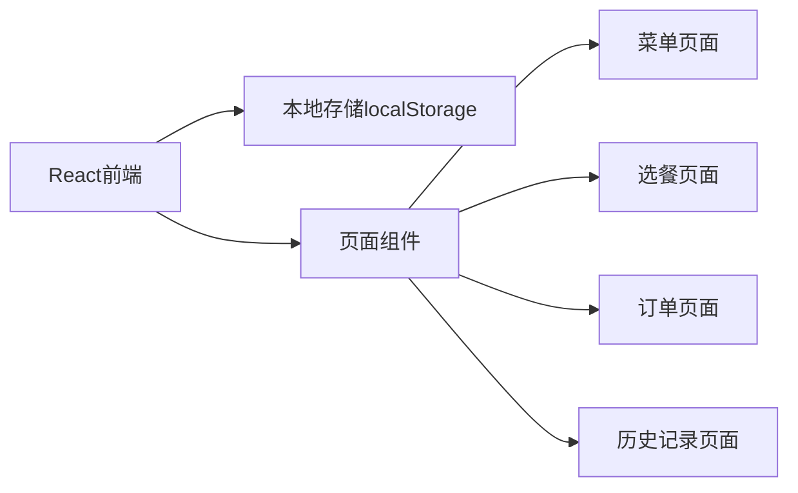
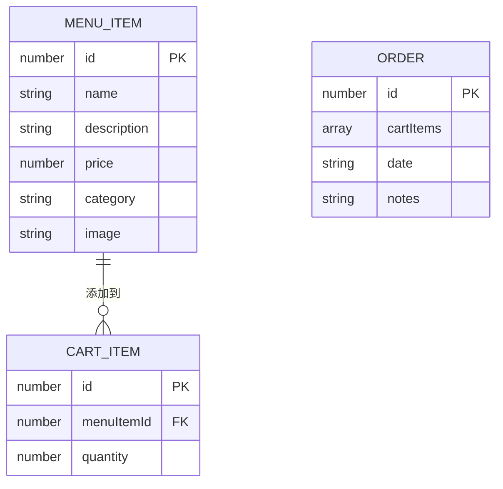

## 1. Architecture Design
前端纯应用，使用本地存储保存数据，无需后端服务



## 2. Technology Description
- 前端：React@18 + TypeScript + Tailwind CSS + Vite
- 初始化工具：vite-init
- 状态管理：Zustand
- 路由：React Router DOM

## 3. Route Definitions
| Route | Purpose |
|-------|---------|
| / | 首页/菜单浏览页面 |
| /select | 互动选餐页面 |
| /cart | 购物车/订单页面 |
| /history | 历史记录页面 |

## 4. Data Model
### 4.1 Data Model Definition



### 4.2 Data Structure
```typescript
// 菜单项目类型
interface MenuItem {
  id: number;
  name: string;
  description: string;
  price: number;
  category: string;
  image: string;
}

// 购物车项目类型
interface CartItem {
  id: number;
  menuItemId: number;
  quantity: number;
}

// 订单类型
interface Order {
  id: number;
  cartItems: CartItem[];
  date: string;
  notes?: string;
}
```

## 5. Project Structure
```
src/
├── components/         # 组件
│   ├── MenuCard.tsx   # 菜单卡片
│   ├── Navbar.tsx     # 导航栏
│   └── CartBadge.tsx  # 购物车徽章
├── pages/            # 页面
│   ├── Home.tsx      # 首页
│   ├── SelectMode.tsx# 选餐页面
│   ├── Cart.tsx      # 购物车
│   └── History.tsx   # 历史记录
├── store/            # 状态管理
│   └── useStore.ts   # Zustand store
├── data/             # 静态数据
│   └── menuData.ts   # 菜单数据
├── App.tsx           # 应用入口
└── main.tsx          # 渲染入口
```
