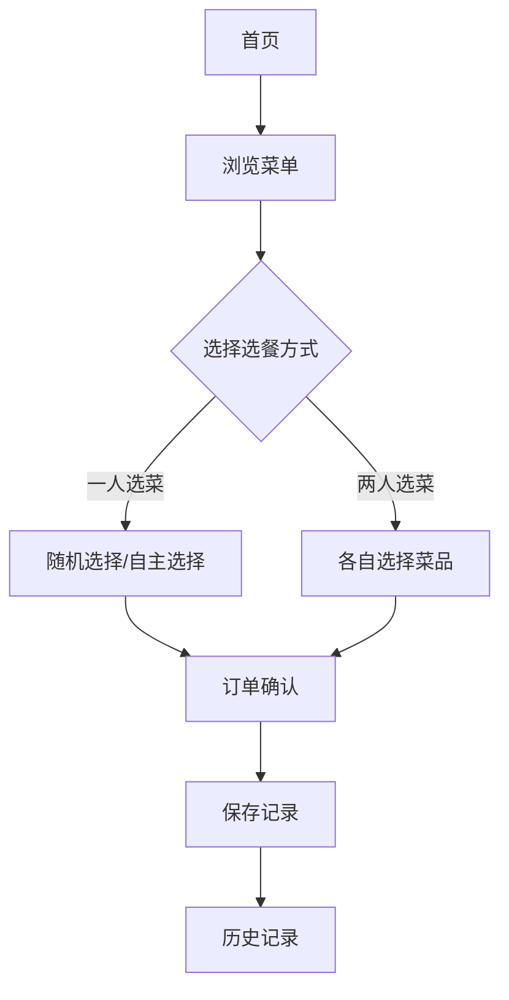

## 1. Product Overview
情侣点单小项目是一款专为情侣设计的互动式点单应用，帮助情侣在餐厅或约会时轻松选择美食。
- 目标是提供有趣的互动选择方式，增加约会体验
- 解决情侣选择困难问题，提供个性化推荐

## 2. Core Features

### 2.1 User Roles
无需登录，简单易用，直接使用

### 2.2 Feature Module
1. **首页/菜单浏览**: 菜单展示、分类筛选、搜索功能
2. **互动选餐**: 一人选择一个菜，另一人选择一个菜，两人一起选餐
3. **购物车/订单**: 订单确认、下单、订单历史
4. **情侣互动**: 爱心打卡、甜蜜时刻记录

### 2.3 Page Details
| Page Name | Module Name | Feature description |
|-----------|-------------|---------------------|
| 首页/菜单浏览 | 菜单展示 | 美食卡片展示、分类标签、价格信息 |
| 互动选餐 | 一人选菜 | 提供推荐菜品、随机选择、趣味玩法 |
| 互动选餐 | 两人共同选菜 | 双方各选一半、合并成餐、确认订单 |
| 购物车 | 订单确认 | 展示选中菜品、数量调整、总价计算 |
| 情侣互动 | 打卡记录 | 记录甜蜜时刻、展示历史记录 |

## 3. Core Process
用户打开应用 → 浏览菜单 → 选择选餐方式（一人或两人）→ 选择菜品 → 确认订单 → 保存记录 → 查看历史

## 4. User Interface Design

### 4.1 Design Style
- 主色调：粉色系（粉色、浅紫色
- 按钮样式：圆角按钮，带爱心装饰
- 字体：可爱圆润的字体
- 布局风格：卡片式布局，温馨浪漫的视觉效果
- 图标/emoji：爱心、玫瑰等浪漫元素

### 4.2 Page Design Overview
| Page Name | Module Name | UI Elements |
|-----------|-------------|-------------|
| 首页 | 菜单展示 | 粉色背景、美食卡片、分类标签 |
| 互动选餐 | 选菜界面 | 情侣头像、分屏设计、互动动画 |
| 购物车 | 订单确认 | 爱心装饰、温馨提示、确认按钮 |
| 历史记录 | 打卡记录 | 时间线展示、甜蜜回忆展示 |

### 4.3 Responsiveness
移动端优先设计，适配各种屏幕尺寸，支持触摸操作

